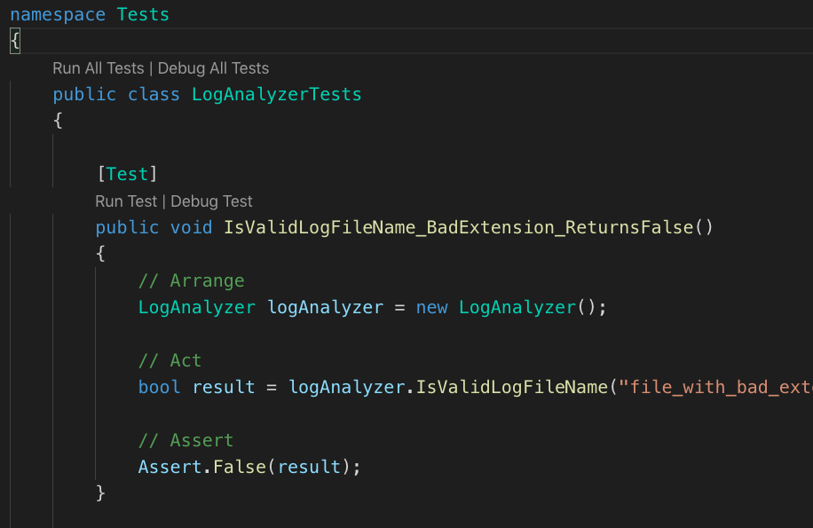

<p align="center">
  <a href="https://www.manning.com/books/the-art-of-unit-testing-second-edition">
    
  </a>
</p>
<h1 align="center">
 The Art of Unit Testing, Second Edition <br>
 
</h1>

The Art of Unit Testing is a book written by [Roy Osherove](http://osherove.com/)

## Goal of this repository
<p align="center">
  <a href="https://dotnet.microsoft.com/">
    
  </a>
</p>

Original book was released in 2012 and using ~ C# 5.0 .NET Framework 4.5 which could be run only on Windows. In ~2016 Microsoft released .NetCore - platform that makes .Net crosplaform framework. It means you can run it on windows, mac or linux.

I would like to make examples from book useful for more developers. So all examples here are rewritten to .NetCore. 

### Note
Some atributes or methods from [NUnit](http://nunit.org/) are deprecated or not exist any more, e.g `[ExpectedException]`, so you can't find examples where were they used.

## Useful links
- original examples from book - https://github.com/royosherove/aout2
- examples on NodeJs - https://github.com/devcorpio/the-art-of-unit-testing
- Lots of videos and the book itself can be found at - http://ArtOfUnitTesting.com

## Pre requirements
1. Be use you have installed `dotnet 2.x`. [How to Intall ?](https://dotnet.microsoft.com/download)
2. You favorite IDE:
    - [VsCode](https://code.visualstudio.com/) + [C# Extention](https://marketplace.visualstudio.com/items?itemName=ms-vscode.csharp)
    - [Rider](https://www.jetbrains.com/rider/) 
    - [VisualStudio](https://visualstudio.microsoft.com/)
3. Open project folder and run `dotnet restore` for install dependencies via [NuGet](https://www.nuget.org/). Or just add project path in the end of command.
```
dotnet restore Chap02_FirstTest/LogAn/LogAn.csproj
```
4. For Runing tests open `*.UnitTests` folder and run `dotnet test`. Or just add project path in the end of command.
```
dotnet test Chap02_FirstTest/LogAn.UnitTests/LogAn.UnitTests.csproj
```

### Note
If you're using **VsCode** you run all tests from the file or only one by clicking on `Test runner` helpers. To Enable *(it enable by default)* check this settings:

```
"csharp.testsCodeLens.enabled": true
```

<p align="center">
    
</p>

## Structure of repository
1. Every chapter of the book has a directory where you can find the final version of the code in the mentioned chapter.
2. Every commit has a reference to the chapter related and brief information what kind of changes was made.

### Chapters
### 01. The basics of unit testing
### 02. A first unit test
- `LogAn` classlib project that has two simple clases.
- `LogAn.UnitTests` - unit test project for testing `LogAn` project

